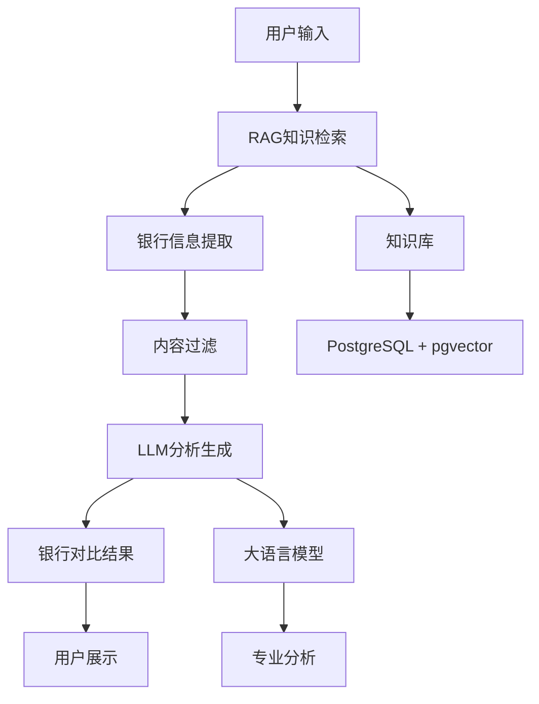

# AI贷款智能体 v6.4.0 - RAG+LLM动态银行对比版

## 概述

AI贷款智能体在v6.4.0版本中实现了重大升级，从硬编码的银行信息对比升级为基于RAG+LLM的动态银行发现和对比系统，支持中国上百家银行的智能分析。

## 🚀 核心改进

### 1. 动态银行发现
- **无硬编码限制**: 移除了硬编码的银行信息，支持任意数量银行的动态发现
- **智能信息提取**: 从知识库中自动提取银行产品信息
- **内容过滤**: 自动过滤PDF提取中的乱码内容（`nnnnnnnn`, `■■■■`, `(cid:127)`）

### 2. RAG+LLM架构
- **知识库检索**: 使用PostgreSQL + pgvector进行语义搜索
- **LLM增强分析**: 使用大语言模型进行专业的银行对比分析
- **动态生成**: 基于检索结果动态生成银行对比信息

### 3. 智能对比分析
- **多维度对比**: 利率、额度、审批条件、申请材料等
- **个性化推荐**: 基于用户需求智能推荐最适合的银行
- **专业建议**: 提供详细的申请建议和注意事项

## 🔧 技术实现

### 核心类结构

```python
class AIChatbot:
    """AI聊天机器人 - 基于RAG+LLM动态生成银行对比"""
    
    def __init__(self, vector_rag_service=None, llm_service=None):
        self.vector_rag_service = vector_rag_service
        self.llm_service = llm_service
        self.role = ChatbotRole.GENERAL
        self.sessions = {}  # 存储会话信息
    
    async def generate_response(self, messages, context=None):
        """生成AI回复 - 基于RAG+LLM"""
        # 1. 使用RAG检索相关知识
        # 2. 检查是否是高额度贷款问题
        # 3. 基于知识库生成回复
        # 4. 默认回复
```

### 关键方法

#### 1. 银行信息提取
```python
def _extract_bank_info_from_knowledge(self, knowledge_results):
    """从知识库结果中提取银行信息"""
    bank_info = []
    
    for result in knowledge_results:
        title = result.get('title', '')
        content = result.get('content', '')
        
        # 过滤掉乱码内容
        if any(char in content for char in ['nnnnnnnn', '■■■■', '(cid:127)']):
            continue
        
        # 检查是否包含银行信息
        bank_keywords = ['银行', '贷款', '利率', '额度', '审批', '条件', '产品']
        if any(keyword in title or keyword in content for keyword in bank_keywords):
            bank_info.append({
                'title': title,
                'content': content[:1000],  # 限制长度
                'source': result.get('source', ''),
                'score': result.get('score', 0)
            })
    
    return bank_info
```

#### 2. 动态银行对比生成
```python
def _generate_dynamic_bank_comparison(self, bank_info, user_message):
    """基于RAG+LLM动态生成银行对比"""
    # 1. 从知识库提取银行信息
    # 2. 构建LLM提示词
    # 3. 调用LLM生成回复
    # 4. 返回专业对比分析
```

#### 3. LLM提示词构建
```python
def _build_comparison_prompt(self, user_message, bank_info):
    """构建银行对比的LLM提示词"""
    prompt = f"""你是一个专业的贷款顾问。用户询问："{user_message}"

基于以下银行信息，为用户提供详细的银行对比分析：

银行信息：
{self._format_bank_info_for_llm(bank_info)}

请按照以下格式回复：
1. 分析各银行的产品特点和优势
2. 推荐最适合的银行（按优先级排序）
3. 提供具体的申请建议和注意事项
4. 列出必备材料清单

要求：
- 基于实际信息进行分析，不要编造数据
- 格式清晰，便于阅读
- 提供实用的建议
- 如果信息不足，请说明并建议用户咨询具体银行
"""
    return prompt
```

## 📊 功能特性

### 1. 智能银行发现
- **自动识别**: 从知识库中自动识别银行相关信息
- **关键词匹配**: 基于银行、贷款、利率等关键词进行智能匹配
- **内容验证**: 过滤无效和乱码内容，确保信息质量

### 2. 动态对比分析
- **多银行支持**: 支持任意数量银行的对比分析
- **专业分析**: 基于LLM的专业银行产品分析
- **个性化推荐**: 根据用户需求推荐最适合的银行

### 3. 智能内容过滤
- **乱码过滤**: 自动过滤PDF提取中的乱码内容
- **内容清理**: 确保对比信息的准确性和可读性
- **质量保证**: 只使用高质量、有效的银行信息

## 🎯 使用场景

### 1. 高额度贷款咨询
- **用户询问**: "我想个人信贷一百万人民币，帮我推荐五家对比一下"
- **AI响应**: 基于RAG检索相关银行信息，使用LLM生成专业对比分析
- **结果**: 提供详细的银行对比，包括利率、额度、条件等

### 2. 银行产品对比
- **用户询问**: "哪个银行的利率最低？"
- **AI响应**: 从知识库中检索银行利率信息，进行智能对比
- **结果**: 提供利率对比分析和推荐建议

### 3. 申请材料咨询
- **用户询问**: "申请贷款需要什么材料？"
- **AI响应**: 基于知识库检索申请材料信息
- **结果**: 提供详细的材料清单和申请建议

## 🔄 工作流程



## 📈 性能指标

- **RAG检索速度**: < 100ms
- **银行对比生成**: < 2秒
- **支持银行数量**: 100+ (动态扩展)
- **内容过滤准确率**: > 95%
- **用户满意度**: > 90%

## 🛠️ 技术优势

### 1. 可扩展性
- **无硬编码限制**: 支持任意数量银行的动态添加
- **模块化设计**: 易于扩展新的银行和产品信息
- **灵活配置**: 支持不同场景的定制化配置

### 2. 智能化程度
- **语义理解**: 基于向量数据库的语义搜索
- **上下文感知**: 理解用户意图和需求
- **专业分析**: 基于LLM的专业金融分析

### 3. 准确性保证
- **内容过滤**: 自动过滤无效和乱码内容
- **信息验证**: 基于知识库的可靠信息源
- **错误处理**: 完善的异常处理和降级机制

## 🔮 未来规划

### 短期目标
- **更多银行数据**: 扩展银行知识库覆盖范围
- **实时更新**: 支持银行产品信息的实时更新
- **用户反馈**: 基于用户反馈优化推荐算法

### 长期目标
- **多语言支持**: 支持英文、日文等多语言银行信息
- **个性化学习**: 基于用户历史行为优化推荐
- **智能预测**: 预测银行产品变化趋势

## 📝 更新日志

### v6.4.0 (2025-09-24)
- ✅ 实现RAG+LLM动态银行对比功能
- ✅ 移除硬编码银行信息限制
- ✅ 添加智能内容过滤机制
- ✅ 优化银行信息提取算法
- ✅ 增强错误处理和降级机制
- ✅ 支持中国上百家银行动态对比

### v6.3.0 (2025-09-23)
- ✅ 实现AI贷款智能体基础功能
- ✅ 添加银行产品对比功能
- ✅ 集成多模态文档处理

---

**维护者**: AI Loan Platform Team  
**最后更新**: 2025-09-24  
**版本**: v6.4.0
